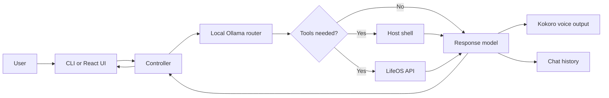

# CIEL

**Central Intelligence and Execution Layer** — a local-first personal AI assistant with a local tool router, a hosted response model, voice output, and an observable web interface.

CIEL uses Ollama to decide whether a request needs tools, executes the selected actions, and sends the results to an OpenAI-compatible model endpoint for the final response. It can work with the local shell and, optionally, a LifeOS instance for tasks, projects, calendar events, notes, habits, and other personal data.

> [!WARNING]
> CIEL is experimental software. Its `runBash` tool executes model-selected commands through the host shell with `shell=True`. There is currently no sandbox or confirmation step. Run it only in an environment where you understand and accept that risk.

## Highlights

- Local routing through an Ollama model with schema-validated JSON output
- Multi-step Router → Tools → CIEL control loop with a five-iteration safety limit
- Shell execution for direct interaction with the host system
- Optional authenticated LifeOS reads, writes, dashboard data, and notification polling
- Streaming React interface with live state, tool, flag, and event visibility
- Terminal interface and spoken responses using Kokoro TTS
- JSON-backed chat and router history plus rotating application logs

## How it works



For every request, the controller:

1. asks the local Ollama model for a schema-valid routing decision;
2. runs the selected tools in order;
3. gives the user request and tool results to the configured response model;
4. streams, stores, and speaks the response; and
5. repeats only when the router flags indicate that another cycle is needed.

## Requirements

- Linux; the current router prompt and shell tooling are designed around Arch Linux
- Python 3.14 or newer
- Node.js and npm
- A running [Ollama](https://ollama.com/) service with a downloaded chat model
- An API key, model name, and OpenAI-compatible base URL for the response model
- An audio output device; Kokoro uses `sounddevice` and may require PortAudio packages from your distribution
- Optional: a compatible LifeOS server and assistant API key

## Quick start

Clone the repository and enter it:

```bash
git clone https://github.com/Ali-Raza-H/AI_Assistant.git CIEL
cd CIEL
```

Create a Python environment and install the backend dependencies:

```bash
python -m venv .venv
source .venv/bin/activate
python -m pip install --upgrade pip
python -m pip install -r backend/data/install/requirements.txt
```

Install and build the frontend:

```bash
cd frontend
npm ci
npm run build
cd ..
```

Make sure Ollama is running, then download the model you intend to use as the router:

```bash
ollama serve
ollama pull <router-model>
```

If Ollama already runs as a service, only the `ollama pull` command is needed.

## Configuration

Create `backend/.env`:

```dotenv
# Final response model (required)
GEMINI_API=your-api-key
GEMINI_PROV=your-openai-compatible-base-url
GOOGLE_CIEL_MODEL=your-model-name

# Local router (required)
OLLAMA_ROUTER_MODEL=your-local-ollama-model

# LifeOS integration (optional)
LIFEOS_BASE_URL=http://127.0.0.1:5000
LIFEOS_API_KEY=
LIFEOS_TIMEOUT_SECONDS=15
LIFEOS_MAX_RETRIES=1
LIFEOS_RETRY_BACKOFF_SECONDS=0.4
LIFEOS_NOTIFICATIONS_ENABLED=0
LIFEOS_NOTIFICATION_POLL_SECONDS=5

# Web server (optional; defaults shown)
CIEL_WEB_HOST=127.0.0.1
CIEL_WEB_PORT=8765
```

The response provider is called “Gemini” in the current source, but it is accessed through the OpenAI Python client's Chat Completions interface. `GEMINI_PROV` must therefore be the OpenAI-compatible base URL exposed by your provider.

LifeOS is optional. Leave `LIFEOS_API_KEY` empty and notifications disabled when it is not in use. The dashboard will continue to work without LifeOS data.

`backend/.env` is ignored by Git. Never commit API keys or other secrets.

## Running CIEL

Run commands from the repository root so the backend can resolve its schema, history, and log paths.

### Terminal and web interface

After building the frontend, start the combined application:

```bash
source .venv/bin/activate
python backend/main.py
```

The web interface is available at <http://127.0.0.1:8765>, while the same process also accepts terminal input. Enter `/quit` to stop the terminal application.

> [!NOTE]
> `/quit` clears both chat history and transient router history before exiting.

### Web interface only

```bash
source .venv/bin/activate
python backend/server.py
```

This serves the built React application and API on <http://127.0.0.1:8765>.

### Frontend development

Run the API and Vite development server in separate terminals:

```bash
# Terminal 1, from the repository root
source .venv/bin/activate
python backend/server.py
```

```bash
# Terminal 2
cd frontend
npm run dev
```

Open <http://127.0.0.1:5173>. The frontend targets `http://127.0.0.1:8765` by default. To use another API origin, set `VITE_CIEL_API_URL` when starting or building Vite.

## Web interface

The React application has three views:

- **Dashboard** — assistant input plus optional LifeOS tasks, notifications, and calendar data
- **Chat** — persisted conversation history and live response streaming
- **Brain** — operational pipeline stage, controller flags, tool queue, router decision, and recent events

The Brain view exposes operational state only; it does not expose private model reasoning.

## Tools

### `runBash`

Runs a non-empty shell command on the host and returns its output and exit code. Independent commands may be queued in one routing decision and are executed in order.

### `lifeOS`

Calls the authenticated LifeOS assistant API. Supported resources include tasks, projects, goals, habits, calendar events, notes, library items, contacts, journal entries, health, diet, gym activity, finance, daily context, search, and notifications. LifeOS operations are deliberately routed through its API rather than Bash or direct database access.

## API

The FastAPI backend exposes:

| Endpoint | Purpose |
| --- | --- |
| `GET /api/health` | Service health and controller availability |
| `GET /api/state` | Current controller state and recent events |
| `GET /api/chat` | Stored chat messages |
| `GET /api/dashboard` | Available LifeOS dashboard sections |
| `POST /api/messages` | Queue one user message |
| `WS /ws/events` | Stream snapshots, state changes, and response tokens |

Only one controller interaction runs at a time. A concurrent message request receives HTTP `409`.

## Data and logs

CIEL currently stores state in repository-local JSON files:

- `backend/schemas/history/chatHistory.json` — conversation history
- `backend/schemas/history/routerHistory.json` — temporary multi-cycle routing context
- `backend/data/logs/` — rotating debug, info, and error logs

Chat history is included in response-model context. Treat these files as private if conversations or LifeOS results contain personal information.

## Development checks

Run the backend regression tests:

```bash
cd backend
python -m unittest test_lifeos_notifications.py
cd ..
```

Type-check and build the frontend:

```bash
cd frontend
npm run typecheck
npm run build
```

## Project structure

```text
CIEL/
├── backend/
│   ├── main.py                 # Combined terminal and web entry point
│   ├── server.py               # FastAPI and WebSocket server
│   ├── modules/                # Tool validation and execution
│   ├── src/
│   │   ├── controller.py       # Multi-cycle orchestration
│   │   ├── router.py           # Ollama routing and validation
│   │   ├── ciel.py             # Final response and speech pipeline
│   │   ├── providers/          # Model provider adapters
│   │   └── tools/              # History, LifeOS, flags, logs, and TTS
│   └── schemas/                # Router contracts and persisted history
├── frontend/
│   └── src/                    # React/Vite interface
└── pyproject.toml
```

## Current limitations

- Shell commands run directly on the host without approval or sandboxing.
- Voice output is synchronous and runs for every assistant response.
- History and logs are local JSON/text files rather than a database.
- The application accepts only one active interaction at a time.
- The router prompt currently assumes an Arch Linux host.

## License

No license has been added to this repository. Unless one is provided, standard copyright restrictions apply.
