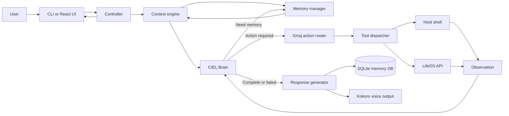

# CIEL

**Central Intelligence and Execution Layer** — a personal AI assistant with a brain-centered runtime loop, modular memory, a Groq-backed action router, local/tool execution, voice output, and an observable web interface.

CIEL uses its primary response model as the central "Brain" that decides whether to answer, ask for clarification, retrieve memory, or request an action. Groq translates requested actions into valid tool calls. The controller executes those calls, turns results into observations, returns them to the Brain, and persists the completed interaction through SQLite-backed memory.

> [!WARNING]
> CIEL is experimental software. Its `runBash` tool executes model-selected commands through the host shell with `shell=True`. Commands have a timeout, but there is currently no sandbox, allowlist, or confirmation step. Run it only in an environment where you understand and accept that risk.

## Highlights

- Brain-owned Think → Act → Observe loop with a controller-enforced safety limit
- Strict structured Brain decisions with validation and bounded format recovery
- Interaction-local context and working memory instead of global cognitive state
- Session-scoped recent conversation plus pre-reasoning long-term memory retrieval
- SQLite-backed raw conversation, session, episodic, semantic, entity, relationship, procedure, and vector-index storage
- Episodic ranking using relevance, importance, recency, and reinforcement
- Fast Groq action routing with schema-guided, locally validated JSON output
- Shell execution with configurable command timeout
- Optional authenticated LifeOS reads, writes, dashboard data, and notification polling
- Streaming React interface with live context, memory, brain, router, tool, observation, response, and event visibility
- Terminal interface and best-effort spoken responses using Kokoro TTS
- Rotating application logs and compatibility wrappers for the old `backend/main.py` and `backend/server.py` launch paths

## How it works



For every request, the controller:

1. creates an `InteractionContext` with isolated working memory;
2. retrieves recent session context and relevant long-term memory before reasoning;
3. asks CIEL Brain for a validated structured decision;
4. routes requested semantic actions through Groq only when execution is needed;
5. runs selected tools and normalizes results as observations;
6. returns observations or additional memory to the Brain and repeats as required;
7. stops when the Brain returns complete, failed, or need-user;
8. generates and streams one final response;
9. persists the completed interaction and evaluates durable memory; and
10. attempts speech as a non-critical side effect.

## Requirements

- Linux; the current router prompt and shell tooling are designed around Arch Linux
- Python 3.14 or newer
- Node.js and npm
- A Groq API key and router model
- Internet access to the Groq API and the configured response-model endpoint
- An API key, model name, and OpenAI-compatible base URL for the response model
- Optional audio output; Kokoro uses `sounddevice` and may require PortAudio packages from your distribution
- Optional: a compatible LifeOS server and assistant API key

## Quick start

Clone the repository and enter it:

```bash
git clone https://github.com/Ali-Raza-H/AI_Assistant.git CIEL
cd CIEL
```

Create a Python environment and install the backend dependencies:

```bash
python -m venv .venv
source .venv/bin/activate
python -m pip install --upgrade pip
python -m pip install -r backend/requirements.txt
```

Install and build the frontend:

```bash
cd frontend
npm ci
npm run build
cd ..
```

## Configuration

Create `backend/.env`:

```dotenv
# Final response / Brain model (required)
GEMINI_API=your-api-key
GEMINI_PROV=your-openai-compatible-base-url
GOOGLE_CIEL_MODEL=your-model-name

# Response provider resilience (optional; defaults shown)
CIEL_RESPONSE_TIMEOUT_SECONDS=60
CIEL_RESPONSE_MAX_RETRIES=2

# Groq action router (required)
GROQ_API_KEY=your-groq-api-key
GROQ_ROUTER_MODEL=openai/gpt-oss-20b

# Groq router resilience (optional; defaults shown)
GROQ_BASE_URL=https://api.groq.com/openai/v1
GROQ_TIMEOUT_SECONDS=30
GROQ_MAX_RETRIES=2
GROQ_RETRY_BACKOFF_SECONDS=0.5

# Shell execution timeout (optional; default shown)
CIEL_SHELL_TIMEOUT_SECONDS=60

# LifeOS integration (optional)
LIFEOS_BASE_URL=http://127.0.0.1:5000
LIFEOS_API_KEY=
LIFEOS_TIMEOUT_SECONDS=15
LIFEOS_MAX_RETRIES=1
LIFEOS_RETRY_BACKOFF_SECONDS=0.4
LIFEOS_NOTIFICATIONS_ENABLED=0
LIFEOS_NOTIFICATION_POLL_SECONDS=5

# Web server (optional; defaults shown)
CIEL_WEB_HOST=127.0.0.1
CIEL_WEB_PORT=8765
```

The response provider is called “Gemini” in the current source, but it is accessed through the OpenAI Python client's Chat Completions interface. `GEMINI_PROV` must therefore be the OpenAI-compatible base URL exposed by your provider.

The legacy Groq names `GROQ_API`, `GROQ_MODEL`, and `GROQ_PROV` are still accepted. GPT-OSS models use Groq's JSON Schema mode; other supported models fall back to JSON Object mode. Every routed tool result is validated locally before execution.

LifeOS is optional. Leave `LIFEOS_API_KEY` empty and notifications disabled when it is not in use. The dashboard continues to work without LifeOS data.

`backend/.env` is ignored by Git. Never commit API keys or other secrets.

## Running CIEL

Run commands from the repository root so the backend can resolve its schema, memory, and log paths.

### Terminal and web interface

After building the frontend, start the combined application:

```bash
source .venv/bin/activate
python -m backend.entrypoints.cli
```

The web interface is available at <http://127.0.0.1:8765>, while the same process also accepts terminal input. Enter `/quit` to stop the terminal application. `/quit` performs a normal shutdown and preserves persisted conversation and long-term memory.

The legacy command still works and delegates to the same entrypoint:

```bash
python backend/main.py
```

### Web interface only

```bash
source .venv/bin/activate
python -m backend.entrypoints.web
```

This serves the built React application and API on <http://127.0.0.1:8765>.

The legacy command still works and delegates to the same entrypoint:

```bash
python backend/server.py
```

### Frontend development

Run the API and Vite development server in separate terminals:

```bash
# Terminal 1, from the repository root
source .venv/bin/activate
python -m backend.entrypoints.web
```

```bash
# Terminal 2
cd frontend
npm run dev
```

Open <http://127.0.0.1:5173>. The frontend targets `http://127.0.0.1:8765` by default. To use another API origin, set `VITE_CIEL_API_URL` when starting or building Vite.

## Web interface

The React application has three views:

- **Dashboard** — assistant input plus optional LifeOS tasks, notifications, and calendar data
- **Chat** — persisted conversation history and live response streaming
- **Brain** — operational pipeline stage, structured Brain decision, compatibility flags, tool queue, router decision, observations, and recent events

The Brain view exposes structured operational state only. It does not expose private model reasoning.

## Tools

### `runBash`

Runs a non-empty shell command on the host and returns its output and exit code. Independent commands may be queued in one routing decision and are executed in order. Commands time out after `CIEL_SHELL_TIMEOUT_SECONDS`, which defaults to 60 seconds.

### `lifeOS`

Calls the authenticated LifeOS assistant API. Supported resources include tasks, projects, goals, habits, calendar events, notes, library items, contacts, journal entries, health, diet, gym activity, finance, daily context, search, and notifications. LifeOS operations are deliberately routed through its API rather than Bash or direct database access.

## Memory model

CIEL distinguishes several forms of state:

- **Working memory** — temporary interaction-local objectives, assumptions, plans, actions, and observations.
- **Recent session context** — recent messages from the current runtime session.
- **Episodic memory** — durable summaries of meaningful interactions, indexed for semantic-style retrieval and ranked by relevance, importance, recency, and reinforcement.
- **Semantic memory** — structured facts with confidence and temporal history when facts change.
- **Entity/relationship memory** — known entities and retrievable relationships between them.
- **Procedural memory** — reusable procedures with success/failure counts and confidence updates.

SQLite remains the source of truth. The current local vector layer uses deterministic hash embeddings as a dependency-free foundation and can later be replaced behind the existing embedding/vector interfaces.

## API

The FastAPI backend exposes:

| Endpoint | Purpose |
| --- | --- |
| `GET /api/health` | Service health and controller availability |
| `GET /api/state` | Current controller state and recent events |
| `GET /api/chat` | Stored chat messages |
| `GET /api/dashboard` | Available LifeOS dashboard sections |
| `POST /api/messages` | Queue one user message |
| `WS /ws/events` | Stream snapshots, state changes, and response tokens |

Only one controller interaction runs at a time. A concurrent message request receives HTTP `409`.

## Data and logs

CIEL stores runtime state in repository-local files:

- `backend/memory/ciel.db` — SQLite source of truth for sessions, raw messages, interactions, episodic memories, semantic facts, entities, relationships, procedures, and the local vector index
- `backend/var/logs/` — rotating debug, info, warning, and error events; warnings currently share the info log

Raw conversation history and durable memory are separate concepts. The context engine selectively retrieves session context and long-term memory rather than injecting complete histories. Full chat contents and arbitrary shell command output are not intentionally written to application logs.

## Development checks

Run the backend regression tests:

```bash
python -m unittest discover -s backend/tests -p "test_*.py"
```

Type-check and build the frontend:

```bash
cd frontend
npm run typecheck
npm run build
```

The repository also contains `.github/workflows/ci.yml`, which runs backend tests and the frontend build on pushes and pull requests.

## Project structure

```text
CIEL/
├── backend/
│   ├── entrypoints/             # CLI and FastAPI launch modules
│   ├── ciel/
│   │   ├── actions/             # Brain action to tool-call routing
│   │   ├── brain/               # Structured CIEL Brain decisions
│   │   ├── context/             # Interaction context and context assembly
│   │   ├── core/                # Controller, routing, response compatibility, events, dispatch
│   │   ├── agent_tools/         # AI-callable shell and LifeOS capabilities
│   │   ├── memory/              # SQLite-backed working, episodic, semantic, entity, procedural, and vector memory
│   │   ├── providers/           # Model-provider adapters
│   │   ├── response/            # Final response generation
│   │   ├── runtime/             # Settings, histories, logging, flags, JSON, TTS
│   │   └── services/            # Independent background services
│   ├── resources/schemas/       # Router contracts, catalog, and examples
│   ├── tests/                   # Categorized automated and legacy tests
│   ├── var/                     # Runtime histories and logs
│   └── requirements.txt
├── cielVault/                   # CIEL's Obsidian vault
├── frontend/
│   └── src/                     # App, API, state, components, pages, styles
├── unaccounted/                 # Preserved artifacts outside the runtime layout
└── pyproject.toml
```

## Current limitations

- Shell commands still run directly on the host with `shell=True`; there is no approval UI, sandbox, privilege reduction, or allowlist yet.
- Speech playback is synchronous, although speech failure no longer invalidates or prevents persistence of the generated response.
- The vector index still uses deterministic hash embeddings rather than a semantic embedding model.
- Memory consolidation across many historical episodes remains a future intelligence layer; current interaction classification and structured memory storage are implemented.
- The application accepts only one active interaction at a time.
- The router prompt currently assumes an Arch Linux host.
- The web API has no authentication and should remain bound to loopback unless an authentication layer is added.

## License

No license has been added to this repository. Unless one is provided, standard copyright restrictions apply.
