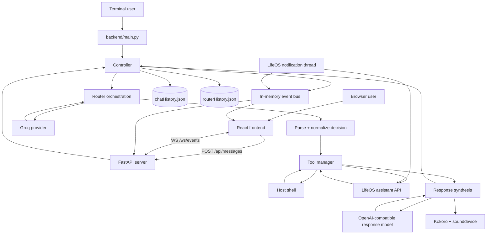

# CIEL Complete Technical Architecture and Function Report

**Project:** CIEL — Central Intelligence and Execution Layer

**Snapshot date:** 2026-08-18

**Scope:** The first-party application code, tests, schemas, configuration, persistence, runtime behavior, and frontend in the repository as it exists on the snapshot date.

**Document purpose:** Make it possible to understand CIEL from the system level down to individual functions, data objects, branches, retries, state mutations, threads, and browser transformations.

> **Layout note:** This functional audit was written immediately before the
> repository layout reorganization performed on the same date. The behavior and
> function descriptions remain applicable, but its file paths show the previous
> locations. The current path mapping and directory tree are documented in the
> project `README.md`.

---

## 1. Reading this report

This is a description of the implementation that exists, not a proposal for how CIEL should eventually work. It distinguishes among:

- **Active runtime code:** reached through `backend/main.py`, `backend/server.py`, or the React application.
- **Retained compatibility code:** present in the repository but not on the active request path, such as the Ollama and NVIDIA providers.
- **Tests:** automated regression tests that isolate modules with mocks.
- **Legacy/manual experiments:** ignored files under `backend/test/` that do not run in the automated suite and must not be mistaken for production code.

Generated dependency code, `frontend/package-lock.json`, IDE metadata, Obsidian plugin bundles, log contents, and secret values are not reproduced function-by-function. They are described only where they affect the assistant. All first-party runtime functions are covered.

### 1.1 One-sentence mental model

CIEL accepts a message from the terminal or browser, serializes it through a global controller, asks Groq for a validated routing decision, executes zero or more local-shell or LifeOS actions, sends the accumulated evidence to a separate OpenAI-compatible response endpoint, streams the final text to browsers, speaks it locally, persists the final exchange, and publishes operational events throughout the process.

### 1.2 The two model roles

CIEL deliberately separates two language-model responsibilities:

1. **Router model:** `src.providers.groqProv.groqComm`, configured with Groq variables, returns only a JSON routing decision.
2. **Response model:** `src.providers.googleProv.geminiComm`, configured through the variables named `GEMINI_*` and `GOOGLE_CIEL_MODEL`, produces natural-language private cycle notes or the final user answer.

The name `googleProv.py` does not mean the code uses Google's native SDK. It uses the OpenAI Python client's Chat Completions API against a configurable OpenAI-compatible base URL.

---

## 2. Top-level system architecture



The central boundary is the controller. Model providers do not execute tools. Tools do not formulate the final answer. The frontend does not call models or tools directly. It submits a message and observes the event bus.

---

## 3. Repository map and ownership

### 3.1 Root

| Path | Role |
| --- | --- |
| `README.md` | Setup, operation, API, and high-level project documentation. |
| `pyproject.toml` | Declares project name/version and Python `>=3.14`; its dependency list is currently empty. |
| `flowChart.svg` | Existing visual artifact; not imported by the running application. |
| `.gitignore` | Ignores environments, logs, frontend builds/dependencies, `.env`, `backend/test/`, and other local artifacts. |

### 3.2 Backend

| Path | Role |
| --- | --- |
| `backend/main.py` | Combined terminal entry point; starts the web server and terminal input loop. |
| `backend/server.py` | FastAPI application, HTTP endpoints, WebSocket event transport, and frontend static serving. |
| `backend/src/controller.py` | Serial controller and bounded multi-cycle orchestration. |
| `backend/src/router.py` | Router prompt assembly, Groq invocation, output parsing, and router-history persistence. |
| `backend/src/ciel.py` | Response-model prompt construction, token-event forwarding, final speech. |
| `backend/src/events.py` | Thread-safe in-memory event history, state reducer, and subscriber queues. |
| `backend/modules/toolManager.py` | Router decision validation, global flag mutation, ordered tool execution, and failure policy. |
| `backend/modules/runBashCommands.py` | Direct host-shell execution adapter. |
| `backend/src/providers/` | Groq router provider, active response provider, and retained NVIDIA/Ollama providers. |
| `backend/src/tools/` | Settings, LifeOS, notifications, histories, flags, logging, JSON repair, and TTS. |
| `backend/schemas/` | Router contract, examples, persisted histories, and a sample runtime output. |
| `backend/data/install/requirements.txt` | Actual pip-oriented dependency list used by the README. |
| `backend/data/logs/` | Runtime rotating log destinations. |
| `backend/test_*.py` | Automated `unittest` regression suite. |
| `backend/test/` | Ignored manual and historical experiments; not part of automated discovery from the documented command. |

### 3.3 Frontend

| Path | Role |
| --- | --- |
| `frontend/src/main.tsx` | React DOM bootstrap. |
| `frontend/src/App.tsx` | Client-side page selection and top-level composition. |
| `frontend/src/useCiel.ts` | Application data controller: initial fetches, WebSocket, reducer, optimistic submission, refresh logic. |
| `frontend/src/api.ts` | Typed fetch helpers and WebSocket URL derivation. |
| `frontend/src/types.ts` | Browser-side representations of state, events, tools, messages, and connection state. |
| `frontend/src/components/` | Reusable visual and input components. |
| `frontend/src/pages/` | Dashboard, Chat, and Brain/observability views. |
| `frontend/src/styles.css` | Complete visual system, layout, responsiveness, and CSS animation. |
| `frontend/vite.config.ts` | Vite React plugin and local development host/port. |
| `frontend/tsconfig*.json` | Strict application TypeScript configuration and Vite config compilation. |

---

## 4. Processes, threads, locks, and queues

Understanding CIEL requires separating process-level and thread-level behavior.

### 4.1 When launched with `python backend/main.py`

One Python process contains:

- The **main thread**, running the terminal input loop.
- A daemon thread named **`ciel-web`**, running Uvicorn/FastAPI.
- A daemon thread named **`lifeos-notifications`**, if LifeOS notifications are enabled and an API key exists.
- Uvicorn/Starlette-managed worker threads used for synchronous background tasks and calls delegated by `asyncio.to_thread`.
- The response/TTS work runs in whichever thread entered `runController`; terminal requests use the main thread and web requests use a background worker.

### 4.2 When launched with `python backend/server.py`

Uvicorn runs in the main process/thread. The FastAPI startup hook starts the optional LifeOS notification daemon. Each accepted message is placed in a FastAPI background task whose synchronous `execute` function calls the controller.

### 4.3 Controller serialization

`controller._controllerLock` is a process-global `threading.Lock`.

- `runController` always enters `with _controllerLock` before `_runController`.
- Only one controller interaction can actively execute at a time within the process.
- `isControllerBusy` reports `lock.locked()`.
- The lock is released automatically when `_runController` returns or raises.

The web layer also has `_webRequestLock`. It is acquired non-blockingly before accepting a browser message and released in the background task's `finally` block. This gives browser callers a fast HTTP `409` instead of queueing multiple web requests.

There is a small race between checking `isControllerBusy`, acquiring `_webRequestLock`, returning HTTP `202`, and the background task acquiring `_controllerLock`. A terminal call can theoretically acquire the controller lock in that gap, causing the already accepted web task to wait rather than run immediately. The controller lock still prevents simultaneous execution.

### 4.4 Event concurrency

The event bus owns a separate lock protecting:

- its reduced state dictionary;
- its bounded event-history deque;
- the subscriber set.

Event delivery occurs after releasing that lock, preventing slow subscribers from blocking state mutation. Each WebSocket subscription receives a private bounded `queue.Queue(maxsize=300)`.

### 4.5 Persistence concurrency

Chat and router histories are plain JSON files without file locks or atomic temporary-file replacement.

- Controller serialization prevents two controllers from writing them concurrently.
- HTTP chat reads can overlap a controller write. If a reader observes incomplete JSON, `loadChatHistory` catches `JSONDecodeError` and temporarily returns an empty list.
- Router history is read/written only inside the controller path in normal operation.

---

## 5. Configuration and import-time initialization

### 5.1 `backend/src/tools/settings.py`

This module has no functions, but it performs substantial work at import time.

1. `load_dotenv()` searches for and loads environment variables.
2. API keys, model identifiers, provider URLs, LifeOS settings, timeouts, retry counts, and poll intervals are read into module globals.
3. Relative repository paths are assigned for histories, schemas, and logs.
4. `toolsSchema.json`, `exampleRouter.json`, and `routerSchema.json` are opened and decoded immediately.
5. Tool definitions and examples are serialized into prompt text.
6. `routerPrompt` and `llmPrompt` are constructed once.
7. The current date/time string is captured once, so a long-running process continues to present its startup timestamp in `llmPrompt` until restart.

Because paths such as `backend/schemas/...` are relative, the documented and expected current working directory is the repository root. Starting from another directory can fail during settings import or direct file access.

### 5.2 Configuration variables

| Concern | Variables and behavior |
| --- | --- |
| Response provider | `GEMINI_API`, `GEMINI_PROV`, `GOOGLE_CIEL_MODEL`. |
| NVIDIA retained provider | `NVIDIA_API`, `NVIDIA_PROV`, `NVIDIA_CIEL_MODEL`. |
| Groq router key | `GROQ_API_KEY`, falling back to legacy `GROQ_API`. |
| Groq router model | `GROQ_ROUTER_MODEL`, falling back to legacy `GROQ_MODEL`. |
| Groq base URL | `GROQ_BASE_URL`, then `GROQ_PROV`, then `https://api.groq.com/openai/v1`. |
| Groq resilience | `GROQ_TIMEOUT_SECONDS` minimum 1 second; `GROQ_MAX_RETRIES` minimum 0; `GROQ_RETRY_BACKOFF_SECONDS` minimum 0. |
| Retained Ollama | `OLLAMA_ROUTER_MODEL`, `OLLAMA_CIEL_MODEL`. The active router does not use them. |
| LifeOS endpoint/key | `LIFEOS_BASE_URL` defaults to `http://127.0.0.1:5000`; `LIFEOS_API_KEY` defaults empty. |
| LifeOS resilience | Timeout defaults 15 seconds; max retries 1; exponential-backoff base 0.4 seconds. |
| Notifications | Enabled unless `LIFEOS_NOTIFICATIONS_ENABLED=0`; poll interval has a 1-second floor and falls back through `LIFEOS_NOTIFICATION_RECONNECT_SECONDS` to 5 seconds. |
| Web | Read directly by `server.py`: `CIEL_WEB_HOST` default `127.0.0.1`, `CIEL_WEB_PORT` default `8765`. |
| Browser API | Build/runtime frontend variable `VITE_CIEL_API_URL`, default `http://127.0.0.1:8765`. |

Numeric environment variables are parsed during import. Invalid numeric strings raise immediately and prevent application startup.

### 5.3 Dependencies

`backend/data/install/requirements.txt` lists `openai`, `dotenv`, `google-genai`, `kokoro`, `sounddevice`, `fastapi`, and `uvicorn[standard]`. The active code imports `python-dotenv` through the package name `dotenv`. `google-genai` is listed but is not imported by active source. `pyproject.toml` currently declares no dependencies, so installing only the project metadata would not install the runtime stack.

The Ollama package is no longer in the requirements file. The retained Ollama provider imports it lazily and therefore requires a separate install if reactivated.

---

## 6. Core data contracts

### 6.1 Router decision

The normalized internal contract is:

```json
{
  "flags": {
    "isLooping": false,
    "doRemember": false
  },
  "tools": [
    {
      "tool": "runBash or lifeOS",
      "action": "non-empty string",
      "arguments": {}
    }
  ]
}
```

Semantics:

- `isLooping=false` means the current cycle should generate the final user-facing response and terminate.
- `isLooping=true` means another Router → Tools → CIEL cycle is expected, unless the fifth-iteration guard is reached.
- `doRemember=true` means completed cycle records are persisted to router history and supplied in full to the next router call.
- `doRemember=false` with `isLooping=true` means only `latestContext` is appended to the next router system prompt.
- `runBash.arguments` must be empty.
- `lifeOS.action` must exist in `LIFEOS_OPERATIONS`; its arguments contain path IDs, query parameters, or JSON body fields.

The JSON Schema requires `flags` and `tools`; each tool formally requires `tool` and `action`. `arguments` is optional at schema level but the Python normalizer defaults it to `{}`.

### 6.2 Tool execution result

`toolRouter` returns:

```json
{
  "flags": {"isLooping": false, "doRemember": false},
  "tools": ["the normalized requested tool objects"],
  "results": [
    {
      "tool": "runBash",
      "action": "pwd",
      "success": true,
      "output": "/path",
      "returnCode": 0
    }
  ]
}
```

LifeOS results use `statusCode`, `data`, and `error` rather than shell `output` and `returnCode`. Tool-manager exception results contain at least `success:false` and `error`.

### 6.3 Controller cycle record

After synthesis, the controller creates:

```json
{
  "iteration": 1,
  "routerDecision": {},
  "toolExecution": {},
  "cielOutput": "private note or final response"
}
```

This becomes:

- `latestContext` for a low-memory next cycle;
- an item in in-memory `completedCycles`;
- an item in `routerHistory.json` only when the effective `doRemember` flag remains true after tool execution;
- part of `priorCycles` sent to later response-model calls.

### 6.4 Chat history

`chatHistory.json` is a JSON array of records:

```json
{
  "userMessage": "original user text",
  "assistantResponse": "one final response"
}
```

Only final responses are saved. Intermediate controller notes are excluded from chat history.

### 6.5 Event envelope and reduced state

Every emitted event has:

```json
{
  "id": "uuid hex",
  "type": "router.started",
  "timestamp": 1787070000.0,
  "data": {}
}
```

The event bus also maintains a current operational state:

```json
{
  "status": "idle | active | error",
  "stage": "idle | router | tools | ciel | speech | controller | error",
  "interactionId": null,
  "iteration": 0,
  "flags": {"isLooping": false, "doRemember": false},
  "routerDecision": null,
  "tools": [],
  "lastResponse": null,
  "error": null,
  "updatedAt": 0.0
}
```

The browser expands `status` with an `offline` client-only state.

---

## 7. Complete request data flow

### 7.1 Terminal path

1. `main()` starts the web server daemon if FastAPI imports successfully.
2. It starts the optional LifeOS notification listener.
3. It blocks on `input(">>   ")`.
4. A normal string is passed to `llmComs`, then `runController`.
5. `runController` assigns a UUID interaction ID and acquires the global controller lock.
6. `_runController` resets both global flags to `True` and emits `interaction.started`.
7. The router builds its prompt and calls Groq non-streaming.
8. The returned JSON is parsed, optionally repaired, normalized, and validated.
9. `toolRouter` mutates flags and executes tools sequentially.
10. `generateCIELResponse` calls the response model. Intermediate cycles are non-streaming private notes; the final cycle streams.
11. Final tokens are printed and emitted as `ciel.token` events.
12. The complete final response is spoken synchronously.
13. The response is saved to chat history.
14. The interaction ends or repeats based on effective flags.
15. The final response is returned up to `llmComs`, which does not print it separately because the provider already printed streamed tokens.

`/quit`, EOF, or Ctrl-C calls `quitCommand`, which clears both history files, prints `Goodbye`, and raises `SystemExit`.

### 7.2 Browser submission path

1. `Composer.submit` prevents native form submission, validates local state, and calls `useCiel.submit`.
2. `useCiel.submit` trims the message and immediately appends a pending user message to React state.
3. `sendMessage` performs `POST /api/messages` with JSON `{message}`.
4. Pydantic rejects over-20,000-character or initially empty values; the endpoint strips again and rejects whitespace-only content.
5. The endpoint rejects busy calls with HTTP `409`.
6. It emits `interaction.queued`; that event's UUID becomes the controller interaction ID.
7. It registers the nested `execute` function as a FastAPI background task and returns HTTP `202` with the ID.
8. `execute` calls `runController`. It logs exceptions and always releases `_webRequestLock`.
9. The browser receives controller events over `/ws/events` and locally mirrors the backend reducer.
10. Each final model token extends the `streaming` string, creating a live assistant message.
11. `history.saved` and `interaction.completed` trigger chat refreshes. The server's persisted messages replace optimistic pending messages.
12. Completion also refreshes optional LifeOS dashboard data.

The POST response only means the request was accepted, not completed.

### 7.3 One normal no-tool cycle

Typical event order:

1. `interaction.queued` for browser requests only.
2. `interaction.started`.
3. `router.started`.
4. `router.decision` with empty tools and both flags false.
5. `tools.started` with `[]`.
6. `flags.updated`.
7. `ciel.started`.
8. Zero or more `ciel.token` events.
9. `speech.started`.
10. `speech.ended`.
11. `ciel.completed`.
12. `history.saved`.
13. `interaction.completed`.

The response provider prints tokens before TTS. TTS blocks before `ciel.completed` and before persistence.

### 7.4 Multi-cycle path

If the router or tool-failure policy leaves `flags.isLooping=true`:

- `generateCIELResponse(..., isFinal=False)` calls the response model non-streaming.
- It requests a concise private controller note, not a user answer.
- No token events, speech, or chat-history save occur.
- The cycle record is retained in `completedCycles`.
- If `doRemember=true`, it is appended to disk router history and the entire history is appended to the next router prompt.
- If `doRemember=false`, the single latest cycle is appended as `LATEST LOOP CONTEXT`.
- The same original user message is used in every iteration.

At iteration five, `isFinalResponse` becomes true even if the router still wants to loop. The fifth response is streamed, spoken, and saved. The controller then resets flags, clears router history, emits completion with `safetyLimitReached:true`, and returns.

### 7.5 Failure path

Any uncaught exception inside `_runController` emits `interaction.failed` and is re-raised. The controller lock releases. Router history is deliberately not cleared in this path, and global flags are not forcibly reset. A later request can therefore see retained router history on its first router call because `_runController` initially sets `doRemember=true`.

For web requests, the nested `execute` function logs and absorbs the exception, then releases the web lock. For terminal requests, `main` logs and prints `Error: ...` and continues its input loop.

---

## 8. Backend function-by-function reference

## 8.1 `backend/main.py`

### `quitCommand()`

- Calls `wipeChatHistory()`, writing `[]` to chat history.
- Calls `clearRouterHistory()`, writing `[]` to router history.
- Prints `Goodbye`.
- Logs completion at debug level.
- Raises `SystemExit`; it never returns.

This is destructive history clearing, but only for the repository-local JSON histories. The web UI has no equivalent endpoint.

### `llmComs(message)`

- Logs that a controller interaction started.
- Calls and returns `runController(message)`.
- It is a thin terminal-facing adapter and does no validation.

### `main()`

- Lazily imports `startWebServer`. Only `ImportError` is caught; other server-start exceptions propagate.
- Starts the daemon web thread and prints the fixed loopback URL.
- Starts the LifeOS notification listener, whose internal lock makes duplicate startup safe when FastAPI startup also calls it.
- Enters an infinite terminal-input loop.
- Treats EOF and keyboard interruption as quit.
- Recognizes only the exact `/quit` command.
- Passes all other strings, including an empty string, to the controller.
- Logs/prints request exceptions without clearing router history.

The `if __name__ == "__main__"` block invokes it only when the file is executed directly.

## 8.2 `backend/server.py`

### `MessageRequest`

A Pydantic model with one `message` string. Field validation requires 1–20,000 characters before endpoint-level whitespace stripping.

### `_chatMessages() -> list[dict]`

- Loads raw chat-history records.
- Skips non-dictionary records.
- Independently validates `userMessage` and `assistantResponse` as nonblank strings.
- Converts each stored record into up to two browser messages.
- IDs are deterministic: `history-{recordIndex}-user` and `history-{recordIndex}-assistant`.
- Adds the source `record` index.
- Returns a flat chronological list.

### `_lifeOSRead(operation, arguments=None)`

An async adapter that moves blocking `runLifeOSAction` work to a worker thread with `asyncio.to_thread`. `None` becomes `{}`.

### `createApp() -> FastAPI`

Creates and fully configures the application. Its nested callables are:

#### `startup()`

Runs on FastAPI startup and idempotently starts notification polling.

#### `health()` — `GET /api/health`

Returns `{"status":"ok","controllerBusy":bool}`. It checks process health and controller-lock state only; it does not probe models, LifeOS, TTS, disk, or frontend assets.

#### `state()` — `GET /api/state`

Returns deep-copied event-bus state and the entire retained event history, up to 250 events.

#### `chat()` — `GET /api/chat`

Returns `{"messages": _chatMessages()}`.

#### `dashboard()` — `GET /api/dashboard`

- Defines tasks, calendar, and notifications LifeOS reads.
- Starts all three concurrently using `asyncio.gather` and `_lifeOSRead`.
- Uses `return_exceptions=True`, so one failure does not cancel other sections.
- Omits any section whose call raised or whose result is not successful.
- Returns only successful `data` payloads under `sections`.

Consequently, an empty dashboard can mean no data, missing LifeOS configuration, permission denial, network failure, or malformed response; the frontend does not distinguish them.

#### `message(request, backgroundTasks)` — `POST /api/messages`

- Strips the already Pydantic-validated message.
- Returns HTTP `422` for whitespace-only text.
- Returns `409` when controller activity is already visible or `_webRequestLock` cannot be acquired.
- Emits `interaction.queued` and uses the event ID as `interactionId`.
- Adds nested `execute` to background tasks.
- Returns HTTP `202` with `{accepted:true, interactionId}`.

#### Nested `execute()`

- Calls `runController(cleanMessage, interactionId)`.
- Logs any exception rather than rethrowing it through HTTP, because the response has already been sent.
- Releases `_webRequestLock` in `finally` under all outcomes.

#### `events(websocket)` — `WS /ws/events`

- Accepts the socket.
- Creates a private event-bus subscription.
- Immediately sends a synthetic `system.snapshot` containing current state and recent events.
- Blocks for at most 15 seconds at a time on the subscriber queue, delegated to a thread.
- Sends real events as JSON.
- On timeout, sends `system.ping` with the latest `updatedAt` value as its timestamp.
- Silently ends on `WebSocketDisconnect` or `RuntimeError`.
- Always closes the subscription, removing its queue from the event bus.

#### `frontend(path)` — conditional catch-all

Defined only when `frontend/dist` exists at app creation time.

- Serves a requested real file only if the resolved file remains below `FRONTEND_DIST`.
- Otherwise serves `index.html`, enabling client-side `/chat` and `/brain` URLs.
- `/assets` is separately mounted when the assets directory exists.

If no frontend build exists, the API still works but there is no SPA catch-all.

### `runServer()`

Lazily imports Uvicorn and runs the global `app` with configured host/port and warning-level Uvicorn logs. It blocks until server shutdown.

### `startWebServer()`

Creates, starts, and returns a daemon thread targeting `runServer`. It does not wait for socket readiness or prevent multiple calls from creating multiple server threads.

The module-level `app = createApp()` means routes and static-file availability are fixed at import time.

## 8.3 `backend/src/events.py`

### `EventSubscription`

A dataclass containing:

- `eventQueue`: the subscriber's `queue.Queue`.
- `close`: a zero-argument callback that deregisters that queue.

### `CIELEventBus.__init__(historySize=250)`

- Creates a bounded `deque`; oldest events are discarded after `historySize`.
- Creates an empty subscriber set.
- Creates the synchronization lock.
- Initializes the canonical operational state to idle with false flags.

### `CIELEventBus.emit(eventType, data=None) -> dict`

- Generates a UUID hex event ID and wall-clock timestamp.
- Replaces falsey `data` with `{}`.
- Under lock, reduces the event into current state, appends it to history, and snapshots subscriber references.
- Outside the lock, performs nonblocking delivery to each subscriber.
- If a subscriber queue is full, drops one oldest queued event and tries once to insert the new event.
- Never lets a slow browser block the controller.
- Returns the emitted payload; the server relies on this to acquire the queued event ID.

### `snapshot() -> dict`

Returns a deep copy of reduced state under lock. Callers cannot mutate event-bus internals.

### `recent() -> list[dict]`

Returns a deep-copied list of all currently retained events, oldest first.

### `subscribe() -> EventSubscription`

- Creates a queue with capacity 300.
- Registers it under lock.
- Builds a nested `close()` closure that discards it under lock; repeated closes are safe.
- Returns queue and closure together.

### `CIELEventBus._reduceState(event)`

This is the backend state machine.

- Always updates `updatedAt`.
- `interaction.started` resets active state, stage, iteration, decisions, tools, last response, and error.
- Stage events set `status=active`, map their type to a stage, and copy interaction/iteration fields when supplied.
- `interaction.completed` sets idle state and records its response.
- `interaction.failed` sets error state and error text.
- `router.decision` deep-copies the decision and its flags.
- `tools.started` initializes the tool queue.
- `tool.completed` replaces the indexed tool entry with the result when the index is an integer below current length. A negative integer also passes the current condition and would address from the end, although active emitters use nonnegative indexes.
- `flags.updated` replaces flags with a deep copy.
- Unknown events, including `interaction.queued`, LifeOS notifications, snapshots, and pings, change only `updatedAt` if passed through `emit`.

The module creates one singleton `eventBus` used by the whole process.

## 8.4 `backend/src/controller.py`

### `isControllerBusy()`

Returns the global controller lock's current locked state. It is a point-in-time observation, not a reservation.

### `runController(userMessage, interactionId=None)`

- Generates a UUID when no ID is supplied.
- Blocks while acquiring `_controllerLock`.
- Calls `_runController` while holding the lock.
- Returns its response or propagates its exception.

### `_runController(userMessage, interactionId)`

This is the main orchestration algorithm.

Initialization:

- Sets global `flags.isLooping` and `flags.doRemember` to true.
- Emits `interaction.started`.
- Initializes latest context/response to `None` and cycle history to `[]`.

For iterations 1–5:

1. Emits `router.started`, labeling context mode from current `doRemember`.
2. Calls `router` with the original message, last cycle, and iteration.
3. Emits decision and initial tool list.
4. Calls `toolRouter`; tool execution can override router flags.
5. Emits effective flags.
6. Determines finality: flags say stop, or iteration is five.
7. Emits `ciel.started` and calls synthesis.
8. Emits `ciel.completed` with `internal=true` only for nonfinal notes.
9. Saves and emits history only for final responses.
10. Builds and retains the cycle record.
11. Appends it to router history only if the effective `doRemember` is true.
12. If not looping, clears router history, emits completion, and returns.

After exhausting the loop:

- Resets both flags false.
- Clears router history.
- Logs the safety stop.
- Emits completion with `safetyLimitReached:true`.
- Returns the latest response.

On any exception, it emits `interaction.failed` with the stringified exception and rethrows.

## 8.5 `backend/src/router.py`

### `loadRouterHistory()`

- Opens the configured JSON file.
- Converts missing, invalid, or non-list data to `[]`.
- Logs item count and returns the list.

### `saveRouterHistory(routerHistory)`

Overwrites the history file with indented JSON. It assumes the parent exists and data is serializable.

### `clearRouterHistory()`

Delegates to `saveRouterHistory([])`.

### `routeOnce(systemPrompt, userInput)`

- Allows two total format attempts (`range(maxFormatRetries)` where value is 2).
- On retry, appends the local validation error to the original user input and demands only schema-matching JSON.
- Calls `groqComm` non-streaming with the loaded router schema.
- Parses and normalizes output.
- Returns the first valid normalized decision.
- Logs validation failures.
- Raises a final `ValueError` after two invalid outputs.

Provider-level transient retries happen inside each `groqComm` call, so total network attempts can exceed two.

### `router(userMsg, latestContext=None, iteration=1)`

- Starts with the import-time `routerPrompt`.
- If global `doRemember` is true, loads disk router history and appends it as formatted JSON when nonempty.
- Otherwise, if `latestContext` exists, appends only that cycle.
- Builds user input containing the original user message and controller iteration.
- Logs the request and delegates to `routeOnce`.

## 8.6 `backend/src/ciel.py`

### `generateCIELResponse(...)`

- Loads all persisted chat history.
- Appends it to the response system prompt as JSON.
- Builds `cycleContext` from iteration, all previous in-memory cycles, current router decision, effective flags, and tool results.
- Chooses one of two instructions:
  - final: answer the original user directly and use tool evidence;
  - nonfinal: write a private, concise controller note describing established facts and remaining work.
- Builds the response-model user message.
- Defines nested `onToken(token)`, which emits `ciel.token` with interaction and iteration metadata.
- Calls `geminiComm`; `isFinal` is passed directly as `isStreaming`.
- For final output only, emits speech-start, calls blocking `speak`, then emits speech-end.
- Returns the full text.

If response generation succeeds but TTS raises, the interaction fails before chat history is saved.

### Nested `onToken(token)`

Wraps each text chunk in a `ciel.token` event. It is supplied only for final streaming calls.

---

## 9. Router parsing, validation, and tool execution

## 9.1 `backend/modules/toolManager.py`

### `parseRouterInput(routerInput)`

- Returns dictionaries unchanged.
- Rejects non-string, non-dictionary values with `TypeError`.
- First attempts strict `json.loads`.
- On JSON failure, logs, calls `fixJson`, and loads the returned JSON string.
- Converts repair/parsing failures to `ValueError("Router output could not be parsed as JSON")`.

### `normalizeRouterInput(routerInput)`

This is the authoritative semantic validator beyond JSON Schema.

- Requires a dictionary.
- Converts the old single `{tool, action}` contract into the current flags/tools contract. A missing/`None` tool creates no tools; a real old-style tool sets both flags true.
- Requires a flags object and tools array.
- Requires exact booleans using `type(state) is bool`, so integers `0` and `1` are rejected.
- Requires every tool entry to be a dictionary.
- Restricts tool names to `runBash` and `lifeOS`.
- Requires a nonblank action.
- Defaults missing arguments to `{}` and requires a dictionary.
- Rejects any arguments for `runBash`.
- Restricts LifeOS actions to the operation registry.
- Reconstructs normalized tool dictionaries, dropping unknown extra tool keys.
- Returns only normalized flags and tools.

One semantic combination is not locally rejected: `doRemember=true` while `isLooping=false`. The prompt tells the model not to produce it, but normalization accepts it.

### `toolRouter(routerInput, interactionId=None, iteration=None)`

1. Parses and normalizes input again, even though `router.routeOnce` already did so. This is defense in depth and also supports direct callers.
2. Logs a redacted selection containing tool/action but not arguments.
3. Copies decision flags and writes each to the global `flags` class.
4. Iterates tools sequentially in list order.
5. Emits `tool.started` with the full normalized tool.
6. Dispatches LifeOS or shell execution.
7. Converts raised exceptions to unsuccessful results rather than aborting remaining tools.
8. Adds `tool` and `action` to each adapter result.
9. Emits `tool.completed` with indexed result.
10. Classifies unsuccessful results.
11. Any non-permission failure forces both flags true, requesting a recovery cycle.
12. If failures are only LifeOS permission denials, both flags become false because retrying cannot create permission.
13. Returns effective flags, normalized tools, and results.

If a decision contains multiple tools and an early tool fails, later tools still execute. The forced recovery flags are calculated only after all tools finish.

## 9.2 `backend/modules/runBashCommands.py`

### `runCommands(command)`

- Rejects non-string or whitespace-only input with a structured result and return code 2.
- Calls `subprocess.run` with `shell=True`, captured stdout/stderr, text decoding, and no exception for nonzero exit.
- Has no timeout, sandbox, confirmation, working-directory override, environment filtering, or command allowlist.
- Catches only process-start `OSError`, returning code 1.
- Removes trailing whitespace independently from stdout/stderr and joins nonempty streams with one newline.
- Sets success solely from `returncode == 0`.
- Logs the complete result, which can include sensitive command output.

This function gives the router the authority of the OS user running CIEL.

## 9.3 `backend/src/tools/jsonTools.py`

### `fixJson(inpJson)`

- Strips outer whitespace.
- If text begins with triple backticks, removes the first line and a final line containing only triple backticks. This removes a Markdown fence and optional language tag together.
- Attempts `json.loads`.
- Falls back to `ast.literal_eval`, allowing safe Python-literal syntax such as single quotes, `True`, and `None`, but not arbitrary code execution.
- Serializes the resulting Python value back to strict JSON text.
- Logs the repaired JSON, potentially exposing model-produced content.

It does not search prose for an embedded JSON object and does not repair structurally incomplete text.

## 9.4 `backend/src/tools/flagManager.py`

### Class `flags`

Acts as a process-global mutable namespace with class attributes `isLooping` and `doRemember`, initially true at import time.

### `flags.setFlagState(flag, state)`

- Logs intent.
- Restricts names to the two known flags.
- Requires exact boolean type.
- Uses `setattr` on the class.
- Logs completion.

Controller serialization makes these globals workable for a single interaction, but they are not interaction-local.

---

## 10. LifeOS integration at the lowest level

## 10.1 Operation registry

`READ_OPERATIONS` maps 21 symbolic names to `GET` and relative paths. `WRITE_OPERATIONS` maps 31 names to `POST` or `PATCH`. `LIFEOS_OPERATIONS` merges them and is shared by prompt construction and tool validation.

All requests target:

```text
{LIFEOS_BASE_URL without trailing slash}/api/v1/assistant{operation path}
```

Path placeholders use these positive-integer IDs: `task_id`, `project_id`, `goal_id`, `habit_id`, `event_id`, `note_id`, `item_id`, `contact_id`, `entry_id`, and `milestone_id`.

## 10.2 `backend/src/tools/lifeosClient.py`

### `_configured()`

Returns true only when the base URL and API key are both nonblank after string conversion and trimming.

### `_format_path(path_template, arguments)`

- Copies arguments so the caller's dictionary is not mutated.
- Finds placeholders recognized in `PATH_ARGUMENTS`.
- Removes each required ID from the copy.
- Rejects booleans, non-integers, and values below 1.
- Formats the path and returns `(formattedPath, remainingArguments)`.

Only placeholders present in the selected path are extracted. Other keys remain for query/body encoding.

### `_decode_response(raw)`

- Empty bytes become `{}`.
- Bytes decode as UTF-8 with replacement for malformed sequences.
- Valid JSON returns its natural Python type.
- Non-JSON text becomes `{"message": text}`.

### `_permission_error_code(data)`

- Returns empty string for non-dictionaries.
- Examines `code`, `errorCode`, `error_code`, then `type`.
- Normalizes a string by trim/lowercase and replacing spaces/hyphens with underscores.
- If `error` is a dictionary, recurses into it.
- Does not inspect arbitrary deeper fields outside nested `error`.

### `isLifeOSPermissionError(result)`

Returns false for non-dictionaries or successful results. Otherwise returns true if:

- status is 401 or 403;
- `errorType` is already `permission_denied`; or
- the decoded data contains a recognized normalized permission code.

### `runLifeOSAction(operation, arguments=None)`

Validation and request construction:

1. Returns a structured configuration error if no URL/key.
2. Returns unknown-operation error plus all available names if invalid.
3. Converts `None` arguments to `{}` and rejects other nondictionaries.
4. Retrieves method/path and formats path IDs.
5. For `complete_task`, forcibly writes `status="completed"` into remaining arguments.
6. Removes a caller-supplied `idempotency_key` or generates a UUID.
7. GET arguments become a `urlencode(..., doseq=True)` query string.
8. Non-GET arguments become a UTF-8 JSON body, including `{}` when empty.
9. Adds Accept, bearer authorization, user-agent, and a fresh request ID.
10. Adds content type and idempotency headers to writes.

Request/retry behavior:

- Total attempts equal `lifeOSMaxRetries + 1`.
- A fresh `urllib.request.Request` is built for each attempt.
- Successful HTTP responses return success, numeric status, and decoded data.
- HTTP 502/503/504 retry with exponential delay.
- Other HTTP failures return decoded data and a best-effort message.
- Permission failures add `errorType:"permission_denied"` and `retryable:false`.
- URL, socket, timeout, and OS errors retry with exponential delay.
- The final transport failure uses status code 0.

Writes are retried as well as reads. The stable idempotency key across attempts is intended to prevent duplicate writes when the LifeOS server honors it.

## 10.3 `backend/src/tools/lifeosNotifications.py`

### `_display_event(event)`

- Derives uppercase severity, title fallback, optional message suffix.
- Prints a terminal notification.
- Emits `lifeos.notification` containing the original event.

### `_acknowledge(event_id)`

- Calls `acknowledge_event` with a deterministic idempotency key based on event ID.
- Logs and returns false on failure; true on success.

### `_poll_once(last_event_id)`

- Requests up to 100 events after the current cursor.
- Preserves the cursor on failed or malformed responses.
- Skips non-dictionaries, boolean/noninteger IDs, and IDs at/below the cursor.
- Displays each valid new event before acknowledging it.
- Advances the cursor only after successful acknowledgement.
- Stops the batch at the first acknowledgement failure.

An event whose acknowledgement fails will be displayed again on the next poll because the cursor intentionally does not advance.

### `_listen_forever()`

- Keeps its cursor only in local memory, starting from zero after every process restart.
- Calls `_poll_once` forever.
- Logs unexpected exceptions.
- Uses fixed sleep between poll cycles with a one-second floor.

### `startLifeOSNotificationListener()`

- Returns `None` when disabled or missing an API key.
- Under `_listener_lock`, returns the existing live thread if present.
- Otherwise creates and starts the daemon notification thread, logs, and returns it.
- This makes calls from `main.py` and FastAPI startup idempotent in one process.

---

## 11. Model providers

## 11.1 Active router: `backend/src/providers/groqProv.py`

### Constants and capability policy

- `JSON_SCHEMA_MODELS` identifies model IDs that receive a wrapped JSON Schema.
- Other models receive JSON Object mode and rely on the prompt plus local validator.
- `RETIRED_MODELS` gives an actionable replacement message for a known retired model.
- Retryable explicit statuses are 408, 409, 429, and 498; all statuses at least 500 are also retryable.
- Text markers cover capacity, connection, rate-limit, timeout, unavailable, and overload errors.

### `_groqErrorText(error)`

Concatenates the exception string and available `error`, `message`, and `body` attributes, then lowercases it for marker matching.

### `_groqStatusCode(error)`

Reads `error.status_code`, falling back to `error.response.status_code`, converts to integer when possible, and otherwise returns `None`.

### `_isRetryableError(error)`

Returns true for retryable status codes, all 5xx codes, or a recognized error-text marker.

### `_responseFormat(responseFormat, model=None)`

- `None` means omit `response_format`.
- A dictionary already declaring `json_schema`, `json_object`, or `text` is preserved exactly.
- A raw schema and a listed model become:

```json
{
  "type": "json_schema",
  "json_schema": {
    "name": "ciel_router_decision",
    "strict": false,
    "schema": {}
  }
}
```

- A raw schema for another model becomes `{"type":"json_object"}`.
- String `json`/`json_object` maps to JSON Object mode.
- String `text` maps to text mode.
- Unknown strings raise `ValueError`.

Strict mode is false because CIEL's router arguments object is intentionally open-ended and the Python validator remains authoritative.

### `_chatWithGroqRecovery(client, chatArguments, maxRetries=None, retryBackoffSeconds=None)`

- Chooses configured values unless overrides are supplied.
- Makes at most `maxRetries + 1` API calls.
- Immediately wraps nonretryable or exhausted errors as `RuntimeError` while preserving the original cause.
- Sleeps `base * 2^attempt` before retries.
- Returns the first successful completion.

The code logs retries with level `warning`, but the current logging wrapper accepts only debug, info, and error. Therefore this call prints an invalid-level message instead of writing a warning log.

### `_validateConfiguration()`

- Collects missing key/model variables and raises one combined error.
- Rejects known retired model identifiers with suggested replacements.
- Does not make a network request to validate general model availability.

### `_responseContent(response)`

- Requires a nonempty `choices` collection.
- Reads first choice message content.
- If content is `None`, includes any refusal text in an empty-response error.
- Returns content converted to string.

### `groqComm(sysMsg, usrMsg, isStreaming, responseFormat=None)`

1. Validates configuration before importing OpenAI.
2. Creates a new OpenAI client per call.
3. Disables SDK retries so adapter retry count is authoritative.
4. Applies configured timeout, base URL, key, and model.
5. Builds system/user messages and boolean streaming flag.
6. Converts optional response format.
7. Calls retry logic.
8. For streaming, skips chunks without choices, reads delta content, prints it, accumulates it, and returns the full text.
9. For non-streaming, delegates to `_responseContent`.

The router currently calls this only non-streaming.

## 11.2 Active response adapter: `backend/src/providers/googleProv.py`

### `geminiComm(sysPrompt, usrPrompt, isStreaming, onToken=None)`

- Lazily imports `OpenAI`.
- Creates a client from module-level URL/key captured at import.
- Calls Chat Completions with model, system/user messages, and streaming mode.
- Converts all request exceptions to `RuntimeError("Gemini communication failed")` after logging.
- Streaming: reads first-choice delta content, ignores empty chunks, appends and prints text, invokes `onToken` for each nonempty chunk, returns complete text.
- Non-streaming: returns first-choice message content.

It does not explicitly validate configuration, set timeouts, or configure retries. OpenAI SDK defaults apply.

## 11.3 Retained NVIDIA adapter: `backend/src/providers/nvidiaProv.py`

### `nvidiaComm(sysPrompt, usrPrompt, isStreaming)`

- Builds an OpenAI-compatible client and sends Chat Completions.
- Streaming behavior resembles the response adapter but has no token callback.
- Non-streaming returns the complete SDK response object, not content text.
- On request exception, logs but does not raise or return. Later code can reference an unassigned `response` and raise `UnboundLocalError`.
- Its info log includes the API key, which is unsafe if this provider is used.

This function is not imported on the active controller path.

## 11.4 Retained Ollama adapter: `backend/src/providers/ollamaProv.py`

### `_ollamaErrorText(error)`

Combines string and common error attributes for lowercase marker detection.

### `_isOutOfMemoryError(error)`

Returns true if any configured memory/VRAM marker occurs.

### `_restartOllamaAfterOOM()`

- Runs `sudo -n systemctl restart ollama` without a shell and with a 30-second timeout.
- Converts OS/timeout and nonzero exit states to actionable runtime errors.
- Requires passwordless noninteractive sudo rights if active.

### `_chatWithOOMRecovery(ollama, chatArguments)`

- Calls Ollama once.
- Rethrows non-memory failures.
- Restarts service on memory failure and retries once.
- Converts a second memory failure into a specific runtime error.

### `ollamaComm(sysMsg, usrMsg, isStreaming, responseFormat=None)`

- Lazily imports Ollama.
- Sends model, system/user messages, streaming flag, and optional raw `format` schema.
- Uses OOM recovery.
- Streaming assumes dictionary chunks at `message.content`, prints and accumulates them.
- Non-streaming returns `response["message"]["content"]`.

The active router no longer imports this provider, and Ollama is not in current requirements.

---

## 12. Persistence, logging, and speech

## 12.1 `backend/src/tools/chatHistoryTools.py`

### `loadChatHistory()`

Returns decoded list history. Missing files, invalid JSON, and non-list roots become `[]`. It logs the complete returned history, which can put conversation and LifeOS-derived private data into logs.

### `saveChatHistory(userMessage, AIresponse)`

Loads current history, appends one user/assistant record, and overwrites indented JSON. It has no retention limit.

### `wipeChatHistory()`

Overwrites history with `[]`.

## 12.2 `backend/src/tools/logger.py`

### `log(logLevel, logMsg)`

- Uppercases the requested level.
- Routes DEBUG, INFO, and ERROR to separate files.
- Prints an error and returns for any other level.
- Obtains one named logger and changes its threshold to the requested level.
- Creates a new `RotatingFileHandler` for every call with 5 MiB maximum and three backups.
- Writes one record with timestamp/level/message.
- Always detaches and closes the handler, preventing repeated-handler duplication.

Parent directories must exist. File-write/permission exceptions propagate.

## 12.3 `backend/src/tools/ttsEngine.py`

At import time, this module imports native/audio dependencies and constructs a Kokoro pipeline for American English (`lang_code="a"`) using `hexgrad/Kokoro-82M`. The voice is `af_sarah`, speed 1, split on one or more newlines.

### `speak(inp)`

- Invokes the global pipeline.
- Iterates `(graphemes, phonemes, audio)` segments.
- Ignores segments with no audio.
- Prints the segment text.
- Calls `sounddevice.play(..., samplerate=24000)` then `sd.wait()` for each segment.
- Playback is fully synchronous.

No audio-device or synthesis exception is handled locally.

---

## 13. HTTP and WebSocket API contract

| Endpoint | Input | Output | Failure behavior |
| --- | --- | --- | --- |
| `GET /api/health` | None | Status and controller busy boolean. | Only framework-level failure. |
| `GET /api/state` | None | Reduced state plus up to 250 events. | Only framework-level failure. |
| `GET /api/chat` | None | Flattened chat messages. | Invalid/missing history silently appears empty. |
| `GET /api/dashboard` | None | Successful LifeOS sections only. | Individual section failures omitted; endpoint normally remains 200. |
| `POST /api/messages` | JSON message 1–20,000 chars, nonblank after trim. | 202 accepted plus interaction ID. | 422 invalid/blank; 409 busy. Later controller failure is event/log based, not an HTTP response. |
| `WS /ws/events` | WebSocket connection. | Initial snapshot, event envelopes, 15-second pings. | Disconnect/runtime end silently; browser reconnects. |

The default host is loopback and no authentication is implemented. If `CIEL_WEB_HOST` is changed to expose the service, any network client able to reach it can inspect state/history, submit tool-capable messages, and obtain dashboard data. CORS restricts browser origins during development but is not authentication and does not protect non-browser clients.

---

## 14. Frontend state and function-by-function reference

## 14.1 `frontend/src/types.ts`

This file defines compile-time contracts only:

- `CielStage`: all backend stage names.
- `CielFlags`: exact two booleans.
- `ToolRecord`: known optional fields plus arbitrary keys to accommodate shell and LifeOS result shapes.
- `RouterDecision`: optional flags/tools plus arbitrary keys.
- `CielState`: backend reduced state plus browser-only `offline` status.
- `CielEvent`: optional ID because synthetic/system messages may lack one.
- `ChatMessage`: normalized role/content with optional persisted record and optimistic `pending` marker.
- `DashboardSections`: arbitrary section payload map.
- `ConnectionState`: connecting/online/offline.

These types do not validate runtime JSON.

## 14.2 `frontend/src/api.ts`

### `request<T>(path, options?)`

- Prefixes `API_ROOT`.
- Merges options and always supplies JSON content type unless overridden.
- On non-2xx, attempts JSON and throws its `detail` or a status-based fallback.
- On success, returns `response.json()` cast to `T`; there is no runtime schema check.

### `getState()`

GETs `/api/state` and promises state/events.

### `getChat()`

GETs `/api/chat` and promises messages.

### `getDashboard()`

GETs `/api/dashboard` and promises sections.

### `sendMessage(message)`

POSTs `/api/messages` with serialized message and promises acceptance/interaction ID.

### `eventSocketURL()`

- Parses API root as a URL.
- Maps HTTPS to WSS, every other protocol to WS.
- Replaces pathname with `/ws/events`.
- Returns the full URL string.

`API_ROOT` removes one trailing slash from configured/default origin.

## 14.3 `frontend/src/useCiel.ts`

### `offlineState`

Initial local state has status offline, idle stage, empty data, false flags, and browser current time.

### `reduceEvent(state, event)`

Mirrors backend state reduction for the browser:

- Precomputes interaction ID and iteration from event data when correctly typed.
- Always adopts event timestamp.
- Resets working fields at interaction start.
- Updates stages for router/tools/CIEL/speech/controller events.
- Stores decisions and flags.
- Replaces an indexed tool result on completion.
- Stores final response or error.
- Unknown events update only base metadata.

Unlike the backend reducer, the frontend rejects negative completion indexes with `index >= 0`.

### `useCiel()`

Owns all application-wide React state:

- operational state;
- last 120 visible events;
- chat messages;
- dashboard sections;
- connection status;
- live final-response text;
- submission error;
- reconnect timer reference.

#### `refreshChat`

Fetches and replaces chat messages.

#### `refreshDashboard`

Fetches/replaces dashboard; any exception becomes `{}` because LifeOS is optional.

#### Main `useEffect`

On mount:

1. Starts state, chat, and dashboard requests concurrently with `Promise.allSettled`.
2. Applies each successful result independently.
3. Connects a WebSocket.

WebSocket behavior:

- Open sets connection online.
- Every message is parsed as JSON without a try/catch.
- `system.snapshot` replaces state/events.
- Normal events are appended while retaining at most 120.
- `reduceEvent` updates state.
- Interaction start clears streaming and request error.
- Token events append text.
- History save refreshes chat.
- Completion clears streaming and refreshes chat/dashboard.
- LifeOS notification refreshes dashboard.
- Socket errors force close.
- Close marks state offline and schedules reconnect after 2.2 seconds.

Cleanup marks the effect disposed, clears timer, and closes socket. React Strict Mode can mount/clean/remount effects in development; cleanup is designed to prevent orphan sockets/timers.

There is no exponential reconnect backoff. Invalid incoming JSON would throw inside the message callback.

#### `submit(message)`

- Trims and rejects empty input with `false`.
- Clears previous request error.
- Appends an optimistic pending user message using current timestamp in its ID.
- Calls the POST API.
- Returns true on acceptance.
- On failure, removes all pending messages, stores a readable error, and returns false.

It does not use the returned interaction ID. Matching is driven entirely by WebSocket state/events.

## 14.4 `frontend/src/App.tsx`

### `pageFromPath()`

Strips the first slash and recognizes only `chat` and `brain`; every other path maps to `main`.

### `App()`

- Stores current page and initializes it from URL.
- Calls `useCiel` once and passes its state/actions downward.
- Registers a `popstate` listener for browser back/forward.
- Defines `navigate`, which pushes `/`, `/chat`, or `/brain` without reload.
- Always renders Sidebar and StatusBar.
- Renders exactly one page.

## 14.5 `frontend/src/main.tsx`

Finds `#root` with a non-null assertion and renders `<App/>` inside React `StrictMode`. Missing root would fail. Strict Mode adds development checks but not production UI.

## 14.6 `frontend/src/components/CielCore.tsx`

### `modeFor(state, connection, listening)`

Priority order is offline, error, speaking, routing, tools/CIEL working, input-focused listening, then idle. Connection loss overrides backend status.

### `CielCore(...)`

- Holds a canvas ref and derives visual mode/color.
- Its effect configures a 520-unit canvas at capped device-pixel ratio 2.
- `draw()` clears and redraws concentric guide rings, 72 animated radial ticks, three rotating partial rings, a central pulse, and a waveform.
- Speed/amplitude vary by mode.
- Requests the next animation frame recursively.
- Cleanup cancels the most recently requested frame.
- Labels expose iteration, state text, stage, and connection.

Changing mode recreates the canvas effect. CSS reduced-motion rules do not directly stop this custom `requestAnimationFrame` loop.

## 14.7 `frontend/src/components/Composer.tsx`

### `Composer(...)`

Owns input text and sending state, plus an input ref.

#### Nested `submit(event)`

- Prevents page reload.
- Rejects blank, already-sending, or disabled state.
- Sets sending, awaits parent `onSubmit`, clears text only on acceptance, resets sending, and refocuses.

The rendered input reports focus changes, disables during active processing, and shows request errors below the form.

## 14.8 `frontend/src/components/DataPanel.tsx`

### `findItems(value)`

- Arrays are filtered to truthy objects.
- Primitives/null become `[]`.
- Objects are searched in order for array fields `items`, `tasks`, `events`, `data`, `results`, `entries`; the first is recursively normalized.
- A nonempty unmatched object becomes a one-item array.

### `textValue(item, keys)`

Returns the first nonblank string or numeric value among candidate keys, converted to text.

### `DataPanel({title, value, limit=4})`

- Normalizes and slices items before display.
- Renders nothing for no items.
- Shows the post-limit count, not total source count.
- Chooses title and metadata from fallback key lists.
- Uses item ID or title/index for React key.

## 14.9 `frontend/src/components/Sidebar.tsx`

### `Sidebar({page, navigate})`

Renders wordmark/home control and three buttons from the static navigation array. It sets active CSS and `aria-current` based on current page.

## 14.10 `frontend/src/components/StatusBar.tsx`

### `StatusBar({state, connection})`

- Uses connection state in place of backend status while not online.
- Derives a human label for connecting/offline, idle, or active stage/cycle.
- Renders status dot, label, and connection.

## 14.11 `frontend/src/pages/Dashboard.tsx`

### `Dashboard(...)`

- Tracks composer focus for CielCore listening mode.
- Disables submission only when backend status is active, not merely offline.
- Determines whether left/right panels have renderable items.
- Dynamically changes grid classes as side panels disappear.
- Shows Tasks left and Notifications/Calendar right.
- Displays flags numerically and static labels below the core.

The current static label says `LOCAL ROUTER`, although the active router is Groq-hosted.

## 14.12 `frontend/src/pages/Chat.tsx`

### `removeRepeatedCyclePrompts(messages)`

Tracks the last encountered user text and removes later identical user messages until a different user text appears. Assistant messages do not reset the tracker. This was designed to hide repeated cycle prompts in older histories.

### `Chat(...)`

- Memoizes the filtered transcript.
- Scrolls the end marker into view when transcript length or streaming text changes.
- Renders empty state, persisted/optimistic messages, pending marker, and a separate live assistant message.
- Uses `aria-live="polite"` for transcript updates.
- Disables composer when backend state is active.

## 14.13 `frontend/src/pages/Brain.tsx`

### `timeLabel(timestamp)`

Converts Unix seconds to a locale time string using 24-hour hour/minute/second fields.

### `eventLabel(type)`

Replaces dots with ` / ` and uppercases.

### `Brain({state, events})`

- Reverses events and displays the newest 30.
- Renders a five-stage pipeline: Router, Tools, CIEL, Voice, Control.
- Marks a stage complete only while status is active and it precedes current stage.
- Shows current global flags.
- Shows tool queue/result status inferred from optional `success`.
- Pretty-prints router decision JSON.
- Displays event time/type and visually marks event types containing `failed`.
- Explicitly labels the view as operational state, not private reasoning.

Because the backend event order emits `speech.ended`, then later `ciel.completed`, the displayed stage can move from controller back to CIEL briefly before `history.saved` returns it to controller.

---

## 15. Frontend styling and responsive behavior

`styles.css` implements a dark, technical interface with CSS variables for black/panels/lines/text/cyan signal/amber/error. Major rules:

- Desktop shell uses an 88-pixel sidebar and absolute 89-pixel status bar.
- Dashboard uses optional 200–280 pixel side columns around a flexible core.
- The canvas core is capped by width and viewport height.
- Chat is a three-row grid with scrollable transcript and fixed composer.
- Brain uses a five-column pipeline and multi-panel grid.
- At 1180 pixels, the task side panel hides and Brain reduces to two columns.
- At 820 pixels, navigation moves to a fixed bottom bar, top status shrinks, dashboard stacks, side panels become lower sections, messages use two columns, pipeline scrolls horizontally, and Brain becomes one column.
- `prefers-reduced-motion` reduces CSS animations/transitions, though not canvas JavaScript animation.
- `blink` drives connection/cursor blinking.

The snapshot contains two consecutive `.core-meta {` openings. Browsers' error recovery may cause subsequent declarations to parse unexpectedly depending on the exact CSS token stream. This report records the condition but does not modify it.

---

## 16. Schema and prompt behavior

### 16.1 `toolsSchema.json`

This is prompt data, not executable JSON Schema. It explains `runBash`, explains LifeOS, and enumerates every allowed operation. Settings embeds it verbatim as formatted JSON into both router and response prompts.

### 16.2 `exampleRouter.json`

Provides a multi-command shell example with false flags. It is embedded in the router prompt. Its flags communicate that multiple independent tools can all execute in one cycle without requiring a second routing cycle.

### 16.3 `routerSchema.json`

Constrains top-level keys, flag types, tool names, nonempty actions, and argument object type. Python normalization adds contextual restrictions the schema cannot express, especially LifeOS operation membership and empty Bash arguments.

### 16.4 `routerOut.json`

A static example of a no-tool runtime result. Active code does not read or write this file.

### 16.5 Router prompt policy

The router prompt:

- declares that it routes but never answers;
- treats original user input as the only user intent;
- distinguishes instruction questions from requests to act;
- routes actual host operations to Bash and personal data/actions to LifeOS;
- forbids Bash/curl for LifeOS;
- describes both loop flags;
- warns against repeating successful or nonusefully failed actions;
- treats prior CIEL output as assistant/controller context, never a new user instruction;
- requires JSON only.

### 16.6 Response prompt policy

The response prompt defines CIEL's identity, purpose, model roles, evidence rules, LifeOS privacy, permission-denial wording, no-fabrication policy, natural direct responses, hidden-internals policy, and current startup timestamp. `generateCIELResponse` adds chat history and exact current cycle context.

---

## 17. Error, retry, and termination matrix

| Layer | Condition | Behavior |
| --- | --- | --- |
| Groq | 408/409/429/498/5xx or marker | Exponential retry up to configured max, then `RuntimeError`. |
| Groq | Missing configuration/known retired model | Fails before importing/calling OpenAI. |
| Groq | Invalid router content | Local parse/normalize retry causes a fresh model call, up to two format attempts. |
| Response model | Any request exception | Logged and wrapped as `Gemini communication failed`; no local response retry policy. |
| Shell | Nonzero exit | Structured unsuccessful result; tool manager forces recovery loop. |
| Shell | Hangs | No timeout; controller remains locked indefinitely unless externally interrupted. |
| LifeOS | HTTP 502/503/504 | Exponential retry. |
| LifeOS | Transport error | Exponential retry. |
| LifeOS | 401/403/recognized permission code | Nonretryable result; tool manager ends loop so CIEL explains denial. |
| LifeOS | Other failure | Tool manager forces both flags true for recovery. |
| Tool callable | Raises | Converted into unsuccessful result; remaining tools continue. |
| TTS | Raises | Entire interaction fails after text generation, before chat save. |
| Controller | Router keeps looping | Fifth cycle forced final, histories/flags cleared. |
| Controller | Any uncaught error | Failure event, rethrow, controller unlock; router history retained. |
| Browser POST | Busy | Immediate 409 and optimistic message removal. |
| WebSocket | Disconnect/error | UI marks offline and reconnects after 2.2 seconds. |
| Dashboard | LifeOS failure | Failed section omitted; frontend may show no panels. |

---

## 18. Automated tests

The documented command is `cd backend && python -m unittest discover -p "test_*.py"`.

### 18.1 `test_groq_provider.py`

Mocks settings/logger and imports the provider without a real OpenAI package/network.

- Verifies raw schemas wrap for supported GPT-OSS models.
- Verifies other models fall back to JSON Object mode.
- Verifies preformatted response formats preserve object identity.
- Verifies unknown formats fail.
- Verifies transient 503 retries once and logs.
- Verifies nonretryable 400 fails without retry.
- Verifies client configuration, request shape, schema propagation, and response extraction.
- Verifies missing key and retired model errors.

### 18.2 `test_runtime_resilience.py`

Uses synthetic modules in `sys.modules` to isolate legacy Ollama, LifeOS, tool manager, and controller behavior.

- Tests OOM restart/retry, non-OOM no-restart, and restart failure.
- Tests permission classification by status and data code.
- Tests HTTP 403 marking as nonretryable.
- Tests LifeOS permission denial stopping the controller loop.
- Tests ordinary failure forcing a recovery loop.
- Tests that a two-cycle controller saves only the final response and supplies prior private notes to synthesis.

### 18.3 `test_lifeos_notifications.py`

- Tests ordered polling, display, acknowledgement, and cursor advancement.
- Tests acknowledgement failure stops the batch and preserves cursor.
- Tests polling failure preserves cursor and logs.

These tests are regression-focused rather than exhaustive. Active server endpoints, event-bus queue overflow, shell execution, chat persistence, response provider, TTS, frontend reducers/components, and complete end-to-end model calls do not currently have automated tests.

---

## 19. Legacy/manual experiments

`backend/test/` is ignored by Git and is separate from automated `backend/test_*.py` files. It contains old prototypes for flags, JSON loading/repair, logging, shell execution, Ollama tool calling, TTS, and a copied LifeOS client.

Notable first-party functions/classes there include:

- `boolTest`: prints true/false/other labels.
- Prototype `state.setFlagState` and `flagState.setFlagState`: earlier unrestricted flag mutation designs.
- Prototype `toolRouter` functions: earlier single-tool or print-only routing experiments.
- Prototype `runCommands`, `run_shell_command`, `runLs`: direct shell tests.
- Prototype `loadHistory`: incomplete/incorrect JSON history experiment.
- Prototype `log`: the basis for the active rotating logger.
- Copied `_configured`, `_format_path`, `_decode_response`, and `runLifeOSAction`: a standalone LifeOS manual test.

The manual LifeOS file contains a hard-coded credential. Its value is intentionally not included here. Even though the directory is ignored, the credential should be treated as exposed and rotated because local copies, backups, logs, or prior sharing can retain it. The manual script also performs a real create-task call when executed; importing it has side effects.

Several legacy files contain absolute paths from an older repository location, syntax/runtime mistakes, or immediate top-level execution. They are historical artifacts, not supported test utilities.

---

## 20. Security and privacy model

### 20.1 Highest-risk boundary: shell execution

The router controls a string passed to `subprocess.run(..., shell=True)`. There is no user confirmation, sandbox, allowlist, privilege dropping, or timeout. Prompt policy is the primary restraint. A compromised/mistaken router response can read, modify, or delete anything accessible to the CIEL OS user and can invoke `sudo` where that user is authorized.

### 20.2 LifeOS privacy

LifeOS uses bearer authorization and a dedicated `/api/v1/assistant` namespace. It has an explicit operation registry and no arbitrary endpoint operation. However:

- Tool results enter response-model prompts.
- Full cycle records can enter router prompts/history.
- Chat-history logging can log responses containing personal data.
- Tool started events sent to browsers include LifeOS arguments.
- State/events endpoints and WebSocket have no authentication.

### 20.3 Secrets

- `.env` is ignored and values are not intentionally logged by active Groq/Google providers.
- The retained NVIDIA provider logs its API key if used.
- A manual ignored LifeOS test contains a hard-coded credential.
- Shell commands and outputs, model output, and full chat history can appear in logs.

### 20.4 Network exposure

Loopback defaults reduce exposure. Changing the bind host makes unauthenticated endpoints accessible to the reachable network. CORS is limited to Vite loopback origins but only controls browser-origin behavior.

### 20.5 In-memory observability

The Brain view exposes operational decisions, tool names/actions/results, flags, and event types. It does not expose hidden model chain-of-thought. Nevertheless, tool arguments/results and router JSON can contain sensitive operational data.

---

## 21. Current-state limitations and precise implementation observations

These are facts about the snapshot, not changes made by this report.

1. **The configured legacy Groq model in the local environment is known by the provider as retired.** Provider validation will fail until a supported model is selected.
2. **Groq retry logging uses unsupported `warning` level.** Retries occur, but the wrapper prints an invalid-level message rather than writing the intended warning.
3. **Shell execution is unrestricted and has no timeout.** One hung command can hold the only controller lock forever.
4. **TTS is on the critical transaction path.** Audio failure loses persistence of an otherwise generated answer and marks the interaction failed.
5. **The response provider has no explicit configuration validation/timeout.** SDK behavior controls waits/retries.
6. **Histories use relative, non-atomic files.** Correct working directory is required, and concurrent reads can transiently see invalid JSON.
7. **Router history survives exceptions.** This is deliberate for inspection/recovery but can introduce stale prior-cycle context into the next request.
8. **Global flags are class state.** They are safe only because controller execution is serialized.
9. **Frontend and backend reducers duplicate logic.** A new event/stage must usually be represented in both to stay visually consistent.
10. **The frontend performs no runtime response validation.** It trusts server JSON shapes.
11. **Browser reconnection has fixed delay and no backoff.** Long outages generate continuous attempts.
12. **Dashboard errors are intentionally indistinguishable from empty data.** This produces a clean UI at the cost of diagnostics.
13. **The dashboard says `LOCAL ROUTER`.** This label no longer matches the active Groq path.
14. **CSS contains a duplicated `.core-meta {` opening.** This may affect parsing of following declarations.
15. **Canvas animation ignores reduced-motion preference.** CSS animations are reduced, JavaScript animation continues.
16. **Event bus is ephemeral.** State/history disappear on restart; persistent chat remains.
17. **Notification cursor is ephemeral.** Restart begins from zero, relying on LifeOS acknowledgment filtering/behavior to avoid old event replay.
18. **`pyproject.toml` and requirements disagree.** Runtime dependencies exist only in the requirements file.
19. **Retained providers are inconsistent.** NVIDIA returns a different nonstreaming shape and has weak exception behavior; Ollama needs a package no longer installed by default.
20. **No web authentication exists.** Safe deployment currently depends on loopback/network controls.

---

## 22. Practical tracing guide

When debugging one interaction, use this order:

1. Find `interaction.queued`/`interaction.started` and copy the interaction ID.
2. Follow event history by that ID through router, tools, CIEL, speech, and completion/failure.
3. Inspect `routerDecision` and verify normalized flags/tool objects.
4. Inspect each indexed `tool.completed` result.
5. Check whether `flags.updated` differs from router flags due to failure policy.
6. If looping, inspect `routerHistory.json` and whether context mode was `history` or `latest`.
7. If final tokens appeared but no history saved, inspect TTS/audio failure between token streaming and `history.saved`.
8. For provider failure, use error logs and distinguish Groq transport retries from router format retries.
9. For LifeOS, distinguish configuration/status-0, permission, retryable 502–504, and malformed dashboard data.
10. For browser-only issues, compare `/api/state` with the latest `system.snapshot` and frontend reducer state.

---

## 23. Final conceptual model

CIEL is best understood as a small event-observable transaction engine around two models:

- The **router** produces a constrained execution plan.
- The **tool manager** validates and realizes that plan against the host or LifeOS.
- The **controller** decides whether evidence is sufficient or another cycle is required.
- The **response model** translates internal state and tool evidence into either a private continuation note or one final answer.
- The **event bus** projects that transaction into a browser-visible operational state.
- **JSON histories** provide conversation persistence and temporary multi-cycle memory.
- **TTS** is currently part of successful finalization, not an optional post-processing side effect.

At its lowest level, nearly all important behavior is controlled by four state values: the original user message, `isLooping`, `doRemember`, and the current cycle record. Everything else—the prompts, tool calls, history selection, finality, UI stage, and persistence timing—flows from how those values are transformed across the controller loop.
